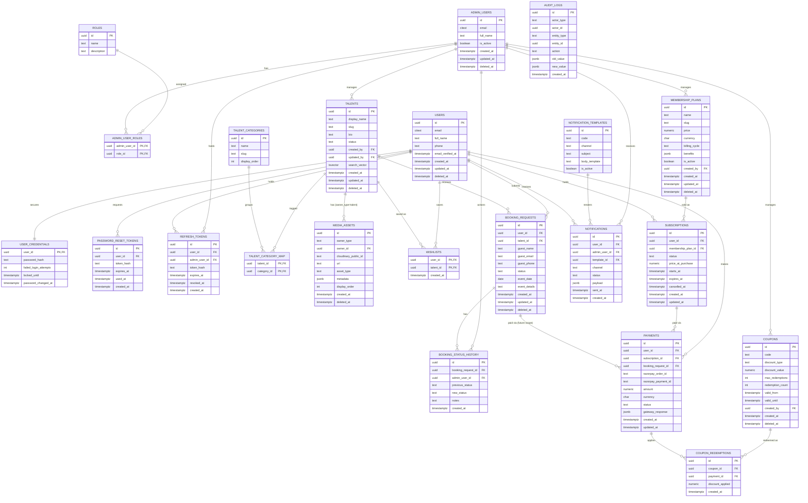

<!-- title: MAYA_X_2.0 — Entity-Relationship Diagram -->

# MAYA_X_2.0 — Entity-Relationship Diagram

_Production database schema · PostgreSQL · v1.0 draft_

Companion diagram to the full **Database Design Document** (DOCX). 21 entities across seven domains: Identity & Access, Talent Catalog, Booking, Membership, Payment, Notification, and Audit. See the design document for column-level data types, constraints, index strategy, and rationale — this view is for structure and relationships only.

### Reading the diagram

| Notation                         | Meaning                                                                                                                                                  |
| -------------------------------- | -------------------------------------------------------------------------------------------------------------------------------------------------------- |
| `\|\|--\|\|`                     | One-to-one — `USERS ↔ USER_CREDENTIALS`, the only true 1:1 in the schema (security-sensitive columns isolated from the hot `users` row).                 |
| `\|\|--o{`                       | One-to-many — the majority of relationships (e.g., one `TALENT` has many `BOOKING_REQUESTS`).                                                            |
| Two `\|\|--o{` into a join table | Many-to-many — `TALENTS ↔ TALENT_CATEGORIES` via `TALENT_CATEGORY_MAP`, `USERS ↔ TALENTS` via `WISHLISTS`, `ADMIN_USERS ↔ ROLES` via `ADMIN_USER_ROLES`. |

`PAYMENTS` carries two nullable foreign keys (`subscription_id`, `booking_request_id`) with a check constraint enforcing exactly one is set — modeling today's confirmed payable (membership) while leaving room for booking-linked payment once that SRS open question is resolved, without a schema change.

`MEDIA_ASSETS` and `AUDIT_LOGS` use a polymorphic `owner_type` / `entity_type` + id pair rather than a dedicated FK per owning table, since both are designed to attach to more than one entity type.
